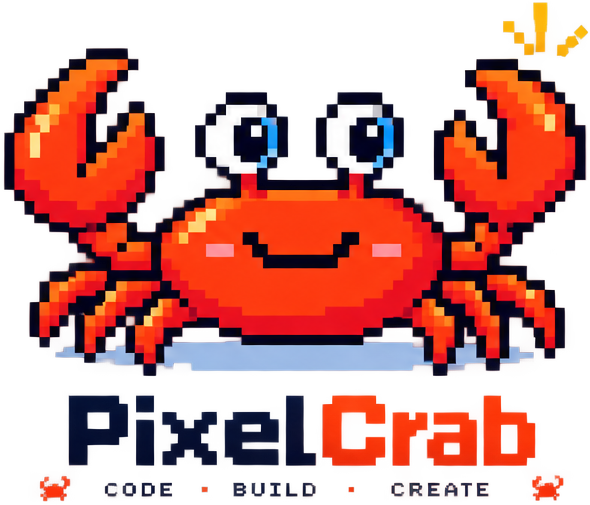

<p align="center">
  
</p>

<h1 align="center">PixelCrabs</h1>

<p align="center"><strong>Have an idea? Make it real.</strong></p>

<p align="center">
  An open-source, local-first visual AI development workspace built on OpenCode.
  Describe an app, preview the real result, point at what should change, and keep iterating in actual source code.
</p>

<p align="center">
  <a href="https://pixelcrabs.com">Website</a> ·
  <a href="https://pixelcrabs.com/updates/">Release notes</a> ·
  <a href="README.zh-CN.md">简体中文</a>
</p>

> This is the new canonical open-source repository for PixelCrabs. It contains the reviewed Web-first source snapshot. For a ready-to-use desktop build, visit the official website.

## Why PixelCrabs?

Most AI coding tools understand files. PixelCrabs also helps you work from the running interface:

- **Build with an established agent core** — OpenCode provides sessions, models, tools, permissions and source changes.
- **Preview the real project** — work against the application's actual development runtime instead of a disposable mockup.
- **Point, box-select and multi-select** — turn visible UI feedback into structured evidence for the same coding agent.
- **Keep projects local** — your source remains in your own project directory and stays usable with normal developer tools.
- **Choose your models** — use supported providers, your own API keys or compatible local and enterprise endpoints.
- **Extend the workflow** — add Skills, MCP servers and focused tools without creating a second agent engine.

## How it works

```text
Describe a goal
      ↓
OpenCode works in the real project
      ↓
PixelCrabs starts and presents the development runtime
      ↓
Select visible elements or regions and add feedback
      ↓
Evidence returns to the same agent session
      ↓
Source changes, preview refreshes, and the result is checked again
```

## Open-source scope

The public edition is Web-first. It is intended for studying, modifying and running the local development workflow yourself.

| Area | Public direction |
| --- | --- |
| Coding engine | Pinned OpenCode source with upstream licenses and attribution |
| Web projects | Discovery, local development runtime, preview and visual feedback |
| Models | User-configured providers, API keys and compatible local services |
| Skills and tools | Local Skills, MCP and reviewed extension interfaces |
| Delivery | Local build and export through your own tools and hosting |
| Flutter | Planned after the Web workflow is stable |

The hosted PixelCrabs account system, platform model credentials and billing, cloud hosting, marketplace operations, private administration services, commercial resources and dedicated publishing integrations are not part of this repository.

## Repository status

The repository has restarted with a clean public history. Its reviewed source snapshot is derived from the final public commit of the legacy repository and includes:

- a pinned OpenCode engine snapshot under `upstream/opencode`;
- the local Web runtime, preview gateway and static export foundation under `packages/local-runtime`;
- the generic desktop system-network bridge under `packages/platform-desktop`;
- public tests and a Linux smoke workflow.

The ready-to-use commercial desktop app remains a separate distribution. This repository is the source-first public edition and does not contain PixelCrabs platform services.

## Quick start

To preview a trusted static site with **Node.js 24 or later**, run this from the repository root:

```sh
node packages/local-runtime/bin/static-preview.mjs /absolute/path/to/your/site
```

The selected directory must contain `index.html`. Open the localhost URL printed in the terminal and press **Ctrl+C** to stop. Framework projects such as React, Vue, Next.js, Nuxt and Astro should use their own development server.

To work with the pinned OpenCode engine, install **Bun 1.3.14** and use its preserved lockfile:

```sh
cd upstream/opencode
bun install --frozen-lockfile
bun dev --help
bun dev /absolute/path/to/your/project
```

Run the dependency-free public runtime tests with:

```sh
node --test packages/local-runtime/test/public-preview-core.test.mjs \
  packages/local-runtime/test/public-static-preview.test.mjs \
  packages/local-runtime/test/public-web-project.test.mjs \
  packages/local-runtime/test/public-web-runtime.test.mjs \
  packages/local-runtime/test/public-preview-gateway.test.mjs
```

The [CI workflow](.github/workflows/opencode-smoke.yml) documents the broader locked-dependency build and test sequence. Some tests download packages and require a native compiler toolchain.

## Security and privacy

- Never commit API keys, access tokens, certificates, cookies or private project data.
- Local-first does not mean every model runs offline. Online model providers receive the context required for requests made through them.
- Provider availability, pricing, retention and model capabilities are controlled by the provider you configure.
- Please report suspected vulnerabilities privately as described in [SECURITY.md](SECURITY.md).

## Contributing

PixelCrabs welcomes reproducible bug reports, focused improvements and discussion about the public Web workflow. Read [CONTRIBUTING.md](CONTRIBUTING.md) before opening a pull request.

## Upstream and licenses

PixelCrabs is built on [OpenCode](https://github.com/anomalyco/opencode). OpenCode and other bundled dependencies retain their own copyright, license and notice files. See [NOTICE.md](NOTICE.md) for provenance rules.

Code authored for this public repository is available under the [MIT License](LICENSE), unless a file or bundled component states otherwise. The MIT license in this repository does not apply to unpublished PixelCrabs services, private source code, trademarks or separately distributed third-party resources.

---

<p align="center"><strong>Your ideas. Your code. Your models.</strong></p>
